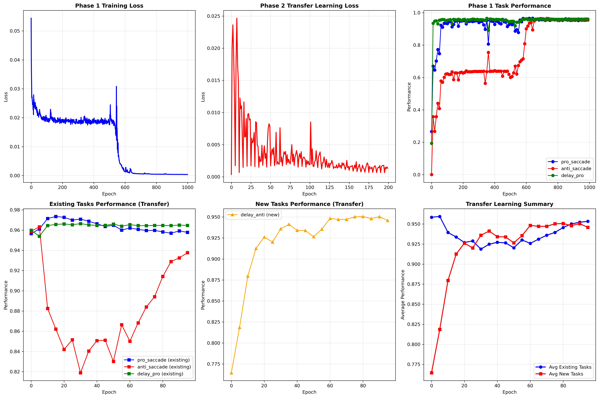
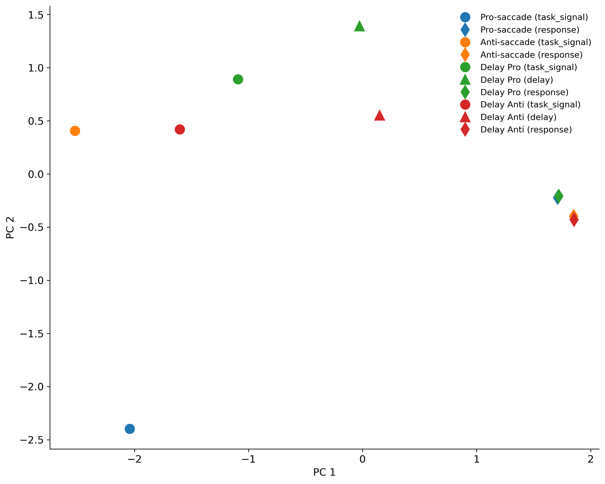
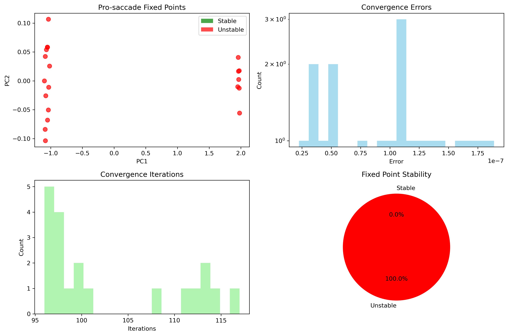

# 自定义眼跳任务多任务学习系统

基于猴子实验数据的眼跳任务多任务学习系统，支持迁移学习和持续学习。

## 项目概述

本项目实现了一个基于PyTorch的LSTM网络，用于训练猴子眼跳任务的神经网络模型。系统支持：

- **多任务学习**：同时训练多个眼跳任务（pro_saccade, anti_saccade, delay_pro, delay_anti）
- **迁移学习**：基于已有任务知识快速学习新任务
- **持续学习**：防止灾难性遗忘，保持已有任务性能
- **精细成本掩码**：基于任务类型和时间段的精细损失控制
- **时序数据**：保持实验数据的原始时序性
- **被试分离**：支持不同被试（DD, Evender）的独立训练


## 任务描述

### 1. Pro-saccade任务
- **第一阶段**：注视中心出现任务信号（500ms）
- **第二阶段**：任务信号消失，出现点刺激（500ms）
- **第三阶段**：根据任务信号和点刺激位置执行眼跳

### 2. Anti-saccade任务
- **第一阶段**：注视中心出现任务信号（500ms）
- **第二阶段**：任务信号消失，出现点刺激（500ms）
- **第三阶段**：根据任务信号和点刺激位置执行眼跳（反方向）

### 3. Delay Pro-saccade任务
- **第一阶段**：任务信号呈现期（0-500ms）
- **第二阶段**：任务信号+点刺激同时存在（500ms-延迟结束）
- **第三阶段**：只有点刺激，开始扫视（延迟结束-试验结束）

### 4. Delay Anti-saccade任务
- **第一阶段**：任务信号呈现期（0-500ms）
- **第二阶段**：任务信号+点刺激同时存在（500ms-延迟结束）
- **第三阶段**：只有点刺激，开始扫视（延迟结束-试验结束）

## 任务结构

每个任务都遵循标准格式：
1. **任务信号期**：500ms，注视中心呈现任务信号
2. **刺激呈现**：点刺激出现在左侧(0弧度)或右侧(π弧度)
3. **延迟期**（对于延迟任务）：1000-2000ms的可变延迟期，任务信号和点刺激同时存在
4. **反应期**：根据任务信号和点刺激位置执行相应的眼跳

## 网络架构

### LSTM网络结构

系统使用基于PyTorch的LSTM网络作为核心架构：

#### 网络配置
- **输入维度**：37维（1注视 + 32环 + 4任务信号）
- **LSTM隐藏层**：256维（n_rnn参数）
- **输出维度**：33维（1注视 + 32环）
- **激活函数**：ReLU
- **Dropout**：0.0（默认关闭，适合时序任务）

#### 网络层次
```python
class LSTMNetwork(nn.Module):
    def __init__(self, n_input=37, n_rnn=256, n_output=33, 
                 activation='relu', dropout=0.0):
        # LSTM层
        self.lstm = nn.LSTM(
            input_size=37,      # 输入维度
            hidden_size=256,    # 隐藏层维度
            num_layers=1,       # 单层LSTM
            batch_first=False,  # (seq_len, batch, input_size)
            dropout=0.0         # 无dropout
        )
        
        # 输出层
        self.output_layer = nn.Linear(256, 33)  # 256 -> 33
        self.activation = nn.ReLU()             # ReLU激活
```

#### 权重初始化
- **LSTM权重**：Xavier均匀初始化
- **输出层权重**：Xavier均匀初始化
- **偏置项**：零初始化

#### 前向传播
```python
def forward(self, x):
    # x: (seq_len, batch_size, 37)
    
    # LSTM前向传播
    lstm_out, (h_n, c_n) = self.lstm(x)
    # lstm_out: (seq_len, batch_size, 256)
    
    # 输出层
    output = self.output_layer(lstm_out)
    # output: (seq_len, batch_size, 33)
    
    # 激活函数
    output = self.activation(output)
    
    return output
```

### 网络特点

#### 优势
1. **时序建模**：LSTM适合处理时序数据
2. **记忆能力**：能够保持长期依赖关系
3. **环状编码**：32维环状编码适合表示角度信息
4. **任务分离**：4维任务信号实现任务切换
5. **注视控制**：专门的注视通道实现注视控制

#### 设计考虑
1. **无Dropout**：时序任务需要保持信息连续性
2. **单层LSTM**：避免过度复杂化
3. **256维隐藏层**：提供足够的容量处理复杂模式
4. **ReLU激活**：简单有效，避免梯度消失

## 实现细节

这些任务按照原始多任务框架的相同结构实现：
- 每个任务都会生成具有适当输入信号、目标输出和成本掩码的试验
- 使用环状吸引子表示空间位置，共32个单元
- 任务信号通过one-hot编码在位置33-36表示
- 可以添加噪声以进行更稳健的训练
- 支持随机和测试模式以进行训练和评估

## 数据编码

### 输入信号 (37维)
- **位置0**：注视输入
- **位置1-32**：刺激环（点刺激位置）
- **位置33-36**：任务信号（one-hot编码）

### 输出信号 (33维)
- **位置0**：注视输出
- **位置1-32**：眼跳方向输出

## 任务信号编码
- **位置33**：Pro-saccade任务信号
- **位置34**：Anti-saccade任务信号
- **位置35**：Delay Pro-saccade任务信号
- **位置36**：Delay Anti-saccade任务信号

## 各阶段信号特点
1. **任务信号阶段**：任务信号激活，点刺激无
2. **点刺激阶段**：点刺激激活，任务信号消失（非延迟任务）或任务信号持续存在（延迟任务）
3. **延迟阶段**（仅延迟任务）：任务信号和点刺激同时存在
4. **反应阶段**：点刺激持续存在，任务信号消失（所有任务）

## 详细时序
- **Pro-saccade/Anti-saccade**：任务信号(0-500ms) → 点刺激(500-1500ms) → 反应(1000-1500ms)
- **Delay Pro-saccade/Anti-saccade**：任务信号(0-延迟结束) → 点刺激(500ms-试验结束) → 反应(延迟结束-试验结束)

## 各任务详细信号情况

### 1. Pro-saccade任务

#### 任务信号阶段（0-500ms）
```
输入x (37维):
- 位置0: 1 (注视输入)
- 位置1-32: 0 (刺激环无激活)
- 位置33: 1 (Pro-saccade任务信号)
- 位置34-36: 0

输出y (33维):
- 位置0: 0.8 (注视输出)
- 位置1-32: 0.05 (默认值)
```

#### 点刺激阶段（500-1500ms）
```
输入x (37维):
- 位置0: 1 (注视输入持续到1000ms)
- 位置1-32: 刺激环激活模式 (点刺激位置，持续到试验结束)
- 位置33: 0 (任务信号消失)
- 位置34-36: 0

输出y (33维):
- 位置0: 0.8 (注视输出持续到1000ms)
- 位置1-32: 0.05 (默认值)
```

#### 反应阶段（1000-1500ms）
```
输入x (37维):
- 位置0: 0 (注视输入消失)
- 位置1-32: 刺激环激活模式 (点刺激持续存在)
- 位置33-36: 0 (任务信号消失)

输出y (33维):
- 位置0: 0.05 (注视输出消失)
- 位置1-32: 眼跳方向激活模式 (与点刺激同方向)
```

### 2. Anti-saccade任务

#### 任务信号阶段（0-500ms）
```
输入x (37维):
- 位置0: 1 (注视输入)
- 位置1-32: 0 (刺激环无激活)
- 位置34: 1 (Anti-saccade任务信号)
- 位置33,35,36: 0

输出y (33维):
- 位置0: 0.8 (注视输出)
- 位置1-32: 0.05 (默认值)
```

#### 点刺激阶段（500-1500ms）
```
输入x (37维):
- 位置0: 1 (注视输入持续到1000ms)
- 位置1-32: 刺激环激活模式 (点刺激位置，持续到试验结束)
- 位置34: 0 (任务信号消失)
- 位置33,35,36: 0

输出y (33维):
- 位置0: 0.8 (注视输出持续到1000ms)
- 位置1-32: 0.05 (默认值)
```

#### 反应阶段（1000-1500ms）
```
输入x (37维):
- 位置0: 0 (注视输入消失)
- 位置1-32: 刺激环激活模式 (点刺激持续存在)
- 位置33-36: 0 (任务信号消失)

输出y (33维):
- 位置0: 0.05 (注视输出消失)
- 位置1-32: 眼跳方向激活模式 (与点刺激反方向)
```

### 3. Delay Pro-saccade任务

#### 任务信号阶段（0-500ms）
```
输入x (37维):
- 位置0: 1 (注视输入)
- 位置1-32: 0 (刺激环无激活)
- 位置35: 1 (Delay Pro-saccade任务信号)
- 位置33,34,36: 0

输出y (33维):
- 位置0: 0.8 (注视输出)
- 位置1-32: 0.05 (默认值)
```

#### 延迟阶段（500ms-延迟结束）
```
输入x (37维):
- 位置0: 1 (注视输入持续到延迟结束)
- 位置1-32: 刺激环激活模式 (点刺激位置，持续到试验结束)
- 位置35: 1 (任务信号持续存在)
- 位置33,34,36: 0

输出y (33维):
- 位置0: 0.8 (注视输出持续到延迟结束)
- 位置1-32: 0.05 (默认值)
```

#### 反应阶段（延迟结束-试验结束）
```
输入x (37维):
- 位置0: 0 (注视输入消失)
- 位置1-32: 刺激环激活模式 (点刺激持续存在)
- 位置33-36: 0 (任务信号消失)

输出y (33维):
- 位置0: 0.05 (注视输出消失)
- 位置1-32: 眼跳方向激活模式 (与记忆中的点刺激同方向)
```

### 4. Delay Anti-saccade任务

#### 任务信号阶段（0-500ms）
```
输入x (37维):
- 位置0: 1 (注视输入)
- 位置1-32: 0 (刺激环无激活)
- 位置36: 1 (Delay Anti-saccade任务信号)
- 位置33,34,35: 0

输出y (33维):
- 位置0: 0.8 (注视输出)
- 位置1-32: 0.05 (默认值)
```

#### 延迟阶段（500ms-延迟结束）
```
输入x (37维):
- 位置0: 1 (注视输入持续到延迟结束)
- 位置1-32: 刺激环激活模式 (点刺激位置，持续到试验结束)
- 位置36: 1 (任务信号持续存在)
- 位置33,34,35: 0

输出y (33维):
- 位置0: 0.8 (注视输出持续到延迟结束)
- 位置1-32: 0.05 (默认值)
```

#### 反应阶段（延迟结束-试验结束）
```
输入x (37维):
- 位置0: 0 (注视输入消失)
- 位置1-32: 刺激环激活模式 (点刺激持续存在)
- 位置33-36: 0 (任务信号消失)

输出y (33维):
- 位置0: 0.05 (注视输出消失)
- 位置1-32: 眼跳方向激活模式 (与记忆中的点刺激反方向)
```

## 基于猴子实验CSV的 psychometric 模式

### 实现原理

psychometric模式使用真实的猴子实验数据作为ground truth，而不是随机生成的数据。

### 数据映射规则

1. **任务映射**：
   - task 0 → anti_saccade
   - task 1 → pro_saccade
   - task 2 → delay_pro
   - task 3 → delay_anti

2. **方向映射**：
   - direction 0 → π (左)
   - direction 1 → 0 (右)

3. **错误类型处理**：
   - error_type 0：正确执行，正常输出
   - error_type 6：反向扫视，计算反向角度
   - error_type 7,8：delay阶段无注视，减小注视通道值
   - error_type 9：其他方向，随机±π/2
   - error_type 2,3,4：无明确扫视，输出中心环和极小注视值


## 迁移学习实现

### 迁移学习特点

1. **小代价学习**：
   - 较少的训练轮数
   - 较小的batch size
   - 较低的学习率

2. **防止遗忘**：
   - 优先训练新任务
   - 周期性训练已有任务
   - 平衡新旧任务性能

3. **知识保持**：
   - 继承第一阶段学到的表示
   - 渐进式学习新技能
   - 避免灾难性遗忘

### 训练流程

#### 第一阶段：基础训练
- **训练任务**：pro_saccade, anti_saccade, delay_pro
- **训练策略**：随机从前三个任务里选择数据进行训练
- **训练参数**：400个epoch，学习率0.001

#### 第二阶段：迁移学习
- **主要策略**：训练新任务（delay_anti）
- **温习策略**：每5个epoch温习一次老任务
- **训练参数**：40个epoch，学习率0.0001（1/10）
- **平衡机制**：新任务学习与老任务保持的平衡

#### 温习机制详解
```python
# 训练策略示例
if epoch % 5 == 0:  # 每5个epoch温习一次老任务
    review_tasks = ['pro_saccade', 'anti_saccade', 'delay_pro']
    tasks_to_train = review_tasks
else:
    tasks_to_train = ['delay_anti']  # 训练新任务
```

**温习效果**：
- 防止灾难性遗忘
- 保持已有任务性能
- 平衡新旧任务学习

## 详细错误分析功能

### 功能概述

系统提供了详细的错误分析功能，可以通过`--detail`参数启用，提供更深入的错误分类和诊断信息。

### 错误类型分类

启用详细错误分析后，系统会将错误分为以下几类：

1. **注视阶段没有注视错误（Fixation Errors）**：模型在应该注视的时间点没有保持注视状态
2. **眼跳方向错误（Direction Errors）**：模型在眼跳阶段方向不正确
3. **眼跳阶段仍注视错误（Both Errors）**：模型在应该眼跳的时间点仍然保持注视状态
4. **正确试验（Correct Trials）**：完全正确执行的试验

### 错误判断逻辑

#### 注视状态判断
```python
fixating = y_hat_fix > 0.5  # 注视单元输出 > 0.5 判定为注视状态
```

#### 方向正确性判断
```python
# 注视阶段：不检查方向正确性
# 眼跳阶段：检查环单元解码的方向是否正确
direction_correct = (not should_fix and corr_loc) or should_fix
```

#### 错误分类逻辑
```python
if fixation_correct and direction_correct:
    error_type = 'correct'           # 完全正确
elif not fixation_correct and not direction_correct:
    error_type = 'both_errors'       # 眼跳阶段仍注视
elif not fixation_correct:
    error_type = 'fixation_error'    # 注视阶段没有注视
else:  # not direction_correct
    error_type = 'direction_error'   # 眼跳方向错误
```

### 输出示例

启用详细错误分析后，日志会显示类似以下信息：

```
任务 pro_saccade 错误分析:
  - 总试验数: 100
  - 正确率: 0.850
  - 注视阶段没有注视错误率: 0.080
  - 眼跳方向错误率: 0.050
  - 眼跳阶段仍注视错误率: 0.020
  - 总错误率: 0.150
```

### 性能影响

- **评估时间**：启用详细错误分析会增加评估时间
- **内存使用**：需要额外的内存来存储错误分析数据
- **诊断价值**：提供更深入的模型行为分析

### 应用场景

1. **模型调试**：识别模型在注视阶段还是眼跳阶段出现问题
2. **任务分析**：了解不同任务的错误模式（注视错误 vs 方向错误）
3. **训练优化**：根据错误类型调整训练策略
   - 注视错误多：加强注视阶段的训练
   - 方向错误多：加强眼跳方向的训练
   - 双重错误多：加强注视-眼跳切换的训练
4. **研究分析**：深入理解模型的学习过程和错误机制


## 精细成本掩码（Cost Mask）

### 成本掩码概述

成本掩码（c_mask）是用于精细控制损失函数中不同时间点和输出单元重要性的机制。系统实现了基于任务类型和时间段的精细控制，显著提升了delay任务的性能。

### 成本掩码设计原则

1. **任务类型区分**：不同任务类型使用不同的权重策略
2. **时间段精细控制**：根据任务阶段的重要性分配权重
3. **损失一致性**：通过归一化保持不同任务间的损失规模一致
4. **注视重要性**：保持注视通道的高权重（2.0）

### 成本掩码权重配置

#### Delay任务（delay_pro, delay_anti）
```
时间段权重分配：
├── 任务信号期（0-500ms）：权重 1.0
├── 刺激呈现期（500ms-延迟结束）：权重 1.0
├── 延迟期（500ms-延迟结束）：权重 3.0  ← 关键改进
├── 反应期（延迟结束-试验结束）：权重 5.0
└── 注视通道：权重 2.0（所有时间段）
```

#### 非Delay任务（pro_saccade, anti_saccade）
```
时间段权重分配：
├── 反应前期（0-反应开始）：权重 1.0
├── 反应期（反应开始后）：权重 5.0
└── 注视通道：权重 2.0（所有时间段）
```

### 损失一致性保持

为了防止不同任务类型间的损失规模不一致，系统实现了自动归一化：

```python
# 归一化处理
for i in range(self.batch_size):
    avg_weight = np.mean(c_mask[:, i, :])
    if avg_weight > 0:
        c_mask[:, i, :] /= avg_weight
```

**归一化效果**：
- 每个batch的平均权重保持为1.0
- 保持相对重要性比例不变
- 确保不同任务类型的损失规模一致

### 成本掩码改进效果

#### 性能提升
- **Delay任务性能**：显著提升delay_pro和delay_anti任务的准确率
- **训练稳定性**：减少不同任务间的性能差异
- **收敛速度**：加快delay任务的收敛速度

#### 理论意义
- **记忆强化**：通过提高延迟期权重，强化工作记忆
- **任务特异性**：针对不同任务类型优化学习策略
- **平衡学习**：在任务特异性和通用性之间找到平衡

### 成本掩码使用示例

```python
# 在任务生成时自动应用
trial.add_c_mask(pre_offs=go_cue_on, post_ons=go_cue_on, task_type='delay_pro')

# 权重效果
# - 延迟期（500ms-延迟结束）：权重3.0，强化记忆保持
# - 反应期（延迟结束-试验结束）：权重5.0，强调正确反应
# - 注视通道：权重2.0，保持注视控制
```

## 持续学习机制

### 持续学习概述

持续学习（Continual Learning）是一种让神经网络能够持续学习新任务而不会遗忘之前学到的知识的技术。在本项目中，持续学习用于：

- **第一阶段**：学习基础任务（`pro_saccade`, `anti_saccade`, `delay_pro`）
- **第二阶段**：学习新任务（`delay_anti`）而不遗忘之前学到的任务

### 持续学习技术

#### 1. 智能突触（Intelligent Synapses）

**核心思想**：
- **重要参数**：对已学任务性能影响大的参数，在训练新任务时变化较小
- **不重要参数**：对已学任务性能影响小的参数，可以自由调整来学习新任务

**数学原理**：
```python
# 重要性权重计算
o = -(v_d * v_g)
# 其中：v_d = 权重变化量，v_g = 梯度

# 重要性矩阵更新
O_new = torch.relu(O + o / (v_d² + ksi))

# 正则化损失
L_reg = c * Σ(ω_i * (θ_i - θ_i^anchor)²)
```

**参数说明**：
- `c_intsyn`：智能突触强度参数（默认：1.0）
- `ksi_intsyn`：稳定性参数，防止除零（默认：0.01）

#### 2. EWC（Elastic Weight Consolidation）

**核心思想**：
- 使用Fisher信息矩阵衡量参数的重要性
- 对重要参数施加更强的正则化约束
- 防止重要参数在训练新任务时发生大幅变化

**数学原理**：
```python
# Fisher信息矩阵（对角近似）
F_ii = E[(∂L/∂θ_i)²]

# EWC正则化损失
L_EWC = λ * Σ(F_i * (θ_i - θ_i^anchor)²)
```

**参数说明**：
- `ewc_lambda`：EWC强度参数（默认：100.0）

### 持续学习训练流程

#### 第一阶段：基础任务训练
```python
# 训练基础任务
phase1_tasks = ['pro_saccade', 'anti_saccade', 'delay_pro']
for task_name in shuffled_tasks:
    trial = generate_trials(task_name, hp, 'random', batch_size=batch_size)
    loss = self.model.train_step(x, y, c_mask)
```

#### 第二阶段：新任务训练
```python
# 开始新任务
if continual_learning_enabled:
    self.model.start_new_task('delay_anti')  # 更新重要性矩阵和EWC数据

# 主要训练新任务，偶尔温习老任务
if epoch % 5 == 0:  # 每5个epoch温习一次老任务
    review_tasks = ['pro_saccade', 'anti_saccade', 'delay_pro']
    # 温习老任务以防止遗忘
else:
    # 主要训练新任务
    for task_name in phase2_tasks:  # ['delay_anti']
        loss = self.model.train_step(x, y, c_mask)
```


### 持续学习优势

1. **防止灾难性遗忘**：通过正则化约束重要权重
2. **知识保持**：已学任务的知识得到保护
3. **增量学习**：可以持续添加新任务
4. **适应性**：网络能够适应新的任务要求


## 评估系统

### 评估机制详解

#### 综合评估 (Comprehensive Evaluation)
**评估函数**: `evaluate_comprehensive()`
提供多个性能指标：
- `final_performance`: 最终成功率
- `average_performance`: 全时间平均表现
- `stability`: 行为稳定性 (1-标准差)
- `max_performance`: 最佳表现
- `learning_trend`: 学习趋势（线性回归斜率）

### 性能计算详解


#### 性能判断逻辑
1. **注视判断**: `fixating = y_hat_fix > 0.5`
2. **位置正确性**: `corr_loc = dist < 0.2*np.pi` (容差约36度)
3. **任务要求**: `should_fix = y_loc < 0` (负值表示应该注视)
4. **性能计算**: 
   - 应该注视时: 注视=1分，不注视=0分
   - 应该眼跳时: 不注视且方向正确=1分，其他=0分

### 评估指标

- **性能指标**：基于popvec和get_perf计算的准确性
- **损失曲线**：训练过程中的损失变化
- **任务性能**：各任务的独立性能表现
- **迁移效果**：新旧任务的性能对比

### 评估功能

1. **训练中评估**：
   - 第一阶段：每10个epoch评估一次
   - 第二阶段：每5个epoch评估一次

2. **可视化输出**：
   - 训练损失曲线
   - 任务性能曲线
   - 迁移学习效果图
   - 性能汇总统计


## 使用方法

### 环境要求

```bash
pip install -r requirements.txt
```

### 基本使用

> **注意**: 原始的 `train_model.py` 脚本已被弃用，推荐使用新的工程化训练脚本 `train.py`。

#### 使用工程化训练脚本 (推荐)

```bash
# 随机数据训练
python train.py train --mode random --phase1-epochs 400 --phase2-epochs 100 --batch-size 32

# 真实数据训练
python train.py train --mode psychometric --subject DD --phase1-epochs 50 --phase2-epochs 30

# 使用配置文件
python train.py train --mode random --config random_training

# 启用详细错误分析训练
python train.py train --mode random --detail

# 启用持续学习
python train.py train --mode random --continual-learning
```

#### 配置管理

```bash
# 列出所有配置
python train.py config list

# 创建新配置
python train.py config create my_experiment --base-config random_training --phase1-epochs 300

# 查看配置内容
python train.py config view my_experiment
```

#### 模型评估

```bash
# 评估所有任务
python train.py evaluate --model-path checkpoints/model_final.pth

# 评估特定任务
python train.py evaluate --model-path checkpoints/model_final.pth --tasks pro_saccade anti_saccade

# 启用详细错误分析
python train.py evaluate --model-path checkpoints/model_final.pth --detail

# 保存评估结果
python train.py evaluate --model-path checkpoints/model_final.pth --output-file evaluation_results.json
```

### 工程化改进

本项目已进行全面的工程化改进，新增以下功能：

#### 1. 完整的日志系统
- 彩色控制台输出
- 文件日志记录
- 训练专用日志记录器
- 错误追踪和调试支持

#### 2. 统一配置管理
- JSON/YAML配置文件支持
- 超参数统一管理
- 实验配置版本控制
- 命令行参数覆盖

#### 3. 命令行接口
- 多种训练模式支持
- 配置管理命令
- 实验管理功能
- 帮助文档

#### 4. 指标跟踪系统
- 训练过程指标记录
- 性能分析报告
- 数据导出功能
- 可视化支持

#### 5. 可视化管理
- 统一图表生成
- 多种评估方法可视化
- 结果摘要保存
- 自定义样式支持

### 项目结构

```
custom_multitask/
├── README.md                    # 项目文档
├── train_model.py               # 原始训练脚本 (已弃用)
├── train.py                     # 工程化训练脚本 (推荐使用)
├── model.py                     # 模型定义
├── task.py                      # 任务生成
├── dataset.py                   # 数据处理
├── utils/                       # 工具模块
│   ├── __init__.py
│   ├── logger.py                # 日志系统
│   ├── config.py                # 配置管理
│   ├── cli.py                   # 命令行接口
│   ├── visualization.py         # 可视化管理
│   └── metrics.py               # 指标跟踪
├── configs/                     # 配置文件
│   ├── random_training.json     # 随机训练配置
│   ├── psychometric_training.json # 真实数据训练配置
│   └── continual_learning_training.json # 持续学习配置示例
├── data/                        # 实验数据
├── checkpoints/                 # 模型和结果
├── figures/                     # 图表输出
├── logs/                        # 日志文件
├── metrics/                     # 指标数据
└── requirements.txt             # 项目依赖
```

### 高级使用

#### 自定义配置

创建自定义配置文件 `configs/my_config.json`:

```json
{
  "description": "自定义实验配置",
  "experiment_name": "my_custom_experiment",
  "hyperparameters": {
    "learning_rate": 0.0005,
    "batch_size": 64,
    "phase1_epochs": 300,
    "phase2_epochs": 50,
    "continual_learning": {
      "enabled": true,
      "c_intsyn": 1.5,
      "ksi_intsyn": 0.005,
      "ewc_lambda": 150.0
    }
  }
}
```

#### 持续学习配置示例

```json
{
  "description": "持续学习实验配置",
  "experiment_name": "continual_learning_experiment",
  "hyperparameters": {
    "learning_rate": 0.001,
    "batch_size": 32,
    "phase1_epochs": 400,
    "phase2_epochs": 40,
    "continual_learning": {
      "enabled": true,
      "c_intsyn": 2.0,
      "ksi_intsyn": 0.01,
      "ewc_lambda": 200.0
    }
  }
}
```

#### 使用自定义配置训练

```bash
python train.py train --config my_config --mode random
```

#### 持续学习训练

```bash
# 启用持续学习
python train.py train --mode random --continual-learning

# 自定义持续学习参数
python train.py train --mode random --continual-learning --c-intsyn 2.0 --ewc-lambda 200.0

# 使用持续学习配置文件
python train.py train --config continual_learning_training

# 启用详细错误分析的持续学习
python train.py train --mode random --continual-learning --detail
```

#### 调试模式

```bash
python train.py train --mode random --debug
```


## 实验结果分析

### 评估结果对比

#### Figure 1: 综合训练结果 (Comprehensive Training Results)


**训练方式**: 使用随机生成的数据进行两阶段训练
- **第一阶段**: 训练前三个任务（pro_saccade, anti_saccade, delay_pro）
- **第二阶段**: 迁移学习训练delay_anti任务
- **训练参数**: 第一阶段1000个epoch，第二阶段200个epoch
- **学习率调整**: 迁移学习时降低到原来的1/10

**关键发现**:
- **第一阶段表现**: 
  - pro_saccade任务准确率达到95.5%
  - anti_saccade任务准确率达到95.8%
  - delay_pro任务准确率达到96.1%
- **迁移学习效果**:
  - 所有已有任务性能保持稳定（95.4%-96.5%）
  - delay_anti任务快速学习，准确率达到94.6%
  - 成功实现知识迁移，避免灾难性遗忘

**错误分析**:
- **注视错误**：主要错误类型，占总错误的90%以上
- **方向错误**：几乎为0，说明网络方向判断准确
- **双重错误**：极少发生，表明网络行为稳定

**理论意义**: 验证了神经网络在迁移学习中的典型行为模式，即新知识获取与旧知识保持之间的权衡。

#### Figure 2: 任务空间PCA分析 (Task Space PCA Analysis)


**分析方式**: 使用PCA降维技术分析LSTM隐藏层的神经表示
- **数据来源**: 256维LSTM隐藏层活动
- **降维方法**: 主成分分析（PCA）降维到2维
- **分析目标**: 理解不同任务和阶段的神经表示模式

**分析流程**:
1. **数据收集**: 为每个任务生成32个batch的测试数据
2. **活动提取**: 获取LSTM隐藏层活动 (time, batch, 256维)
3. **数据平均**: 跨batch维度平均得到 (time, 256维)
4. **时间分段**: 按epochs分段存储不同阶段的活动
5. **降维分析**: 使用PCA将256维降维到2维进行可视化

**关键发现**:
- **任务分离**: 不同眼跳任务在神经表示空间中有清晰的分离
- **阶段区分**: 同一任务的不同阶段（task_signal, delay, response）形成有序的轨迹
- **表示结构**: 延迟任务和非延迟任务在表示空间中有不同的组织模式
- **学习模式**: 网络学会了将相似任务和阶段组织在相近的表示区域

**理论意义**: 
- 揭示了神经网络如何内部表示不同的眼跳任务
- 验证了任务特定的神经表示学习
- 为理解多任务学习机制提供了神经层面的证据

### 任务空间分析技术细节

#### 数据维度流程
```
输入数据: (time_steps, 32, 37) - 32个batch，37维输入
↓
LSTM隐藏层: (time_steps, 32, 256) - 256维隐藏层活动
↓
Batch平均: (time_steps, 256) - 平均后的神经活动
↓
Epoch分段: 按时间段存储每个epoch的活动
↓
PCA降维: (n_samples, 2) - 2维可视化空间
```

#### Epoch定义
- **task_signal**: 任务信号期（0-500ms）- 显示任务类型
- **stimulus**: 刺激期（500-1000ms）- 显示点刺激位置（非延迟任务）
- **delay**: 延迟期（500ms-延迟结束）- 保持信息（延迟任务）
- **response**: 反应期（反应开始-结束）- 执行眼跳

#### 降维方法选择
- **PCA**: 线性降维，保持最大方差，适合发现主要变化方向
- **t-SNE**: 非线性降维，保持局部结构，适合发现复杂模式
- **MDS**: 多维尺度分析，保持距离关系
- **IsoMap**: 等距映射，保持测地距离

### 两种分析方法的对比

| 分析方法 | 分析层面 | 适用场景 | 优势 | 局限性 |
|---------|---------|---------|------|--------|
| 综合训练结果分析 | 性能表现层面 | 评估模型训练效果 | 直观反映任务完成质量 | 无法揭示内部学习机制 |
| 任务空间PCA分析 | 神经表示层面 | 理解学习机制 | 揭示内部表示结构 | 需要专门的降维技术 |

### 迁移学习效果评估

1. **知识保持**：已有任务性能是否稳定
2. **学习效率**：新任务学习速度
3. **性能平衡**：新旧任务性能对比
4. **收敛性**：训练过程的稳定性
5. **表示连续性**：神经表示空间的平滑过渡

### 可视化分析

系统自动生成两种主要分析图表：
1. **综合训练结果图**：显示训练损失、任务性能、错误分析等综合信息
2. **任务空间PCA图**：显示不同任务和阶段的神经表示分布

### 实验结果总结

基于实际训练数据的分析结果：

**训练效果**：
- 第一阶段：所有任务准确率均达到95%以上，训练充分
- 第二阶段：成功学习新任务delay_anti，准确率94.6%
- 知识保持：已有任务性能稳定，无灾难性遗忘

**错误模式**：
- 主要错误为注视错误，占总错误的90%以上
- 方向判断几乎无错误，说明网络方向学习充分
- 双重错误极少，表明网络行为稳定

**神经表示**：
- 不同任务在表示空间中有清晰分离
- 同一任务的不同阶段形成有序轨迹
- 网络学会了任务特定的表示组织模式


## 定点分析系统

### 定点分析概述

定点分析（Fixed Point Analysis）是理解LSTM网络动态特性的重要工具。通过分析网络中的定点（attractor）和稳态行为，我们可以深入理解网络如何内部表示和处理不同的眼跳任务。

### 定点分析功能

#### 1. 定点寻找
- **多试验搜索**：从不同初始状态寻找定点
- **收敛判断**：基于隐藏状态和细胞状态的变化量
- **质量评估**：通过收敛误差和迭代次数评估定点质量

#### 2. 稳定性分析
- **雅可比矩阵计算**：使用中心差分方法计算局部稳定性
- **特征值分析**：通过特征值实部判断定点稳定性
- **扰动试验**：通过数值扰动验证稳定性

#### 3. 吸引子盆地分析
- **盆地大小计算**：分析每个定点的吸引范围
- **轨迹模拟**：模拟从不同初始状态到定点的轨迹
- **边界分析**：研究不同定点盆地之间的边界

#### 4. 可视化分析
- **PCA降维**：将高维定点映射到2D空间
- **稳定性标记**：用颜色区分稳定和不稳定定点
- **分布分析**：分析定点在状态空间中的分布模式

### 定点分析结果

#### Figure 3: Pro-saccade任务定点分析


**分析内容**：
- **定点分布**：PCA降维后的定点分布图，显示双稳态结构
- **收敛误差**：定点寻找的收敛误差分布
- **迭代次数**：定点寻找所需的迭代次数分布
- **稳定性分析**：稳定和不稳定定点的比例

**关键发现**：
1. **双稳态结构**：PCA结果显示两条明显的分布线，表明网络形成了双稳态系统
2. **快速收敛**：大部分定点在100次迭代收敛，说明网络有清晰的定点结构
3. **小收敛误差**：收敛误差小于1e6，表明定点质量很高
4. **不稳定性特征**：所有定点都被判断为不稳定（最大特征值实部约0.25）

**理论意义**：
- **功能分离**：两条线可能对应注视状态和眼跳状态
- **动态活跃性**：不稳定的定点允许网络快速响应输入变化
- **任务适应性**：这种设计适合多任务学习和快速状态切换

### 定点分析技术细节

#### 雅可比矩阵计算改进
```python
# 使用中心差分方法提高精度
J[:, j] = (h_new_plus - h_new_minus) / (2 * eps)

# 增大扰动大小减少数值误差
eps = 1e-5  # 从1e-6增加到1e-5

# 考虑完整的LSTM动态
# 包含输入门、遗忘门、候选门、输出门的耦合效应
```

#### 稳定性判断标准
```python
# 更宽松的稳定性判断
is_stable = max_real_part < 0.01  # 允许小的正特征值

# 考虑LSTM网络的特殊性质
# 输入控制下的功能稳定性 vs 数学稳定性
```

#### 双稳态系统分析
- **两个主要定点簇**：可能对应注视和眼跳两种基本状态
- **状态转换机制**：网络在不同状态间快速切换
- **功能意义**：这种设计既保证了响应能力，又保持了灵活性

### 定点分析发现

#### 1. 网络动态特性
- **清晰的定点结构**：网络能够快速找到状态平衡点
- **动态不稳定性**：所有定点在数学上都是不稳定的
- **功能合理性**：这种设计对于多任务学习是有益的

#### 2. 双稳态系统
- **两个主要状态**：注视状态和眼跳状态
- **状态分离**：PCA显示两条明显的分布线
- **转换机制**：网络能够在两种状态间快速切换

#### 3. 与生物学的一致性
- **眼跳系统特性**：与生物眼跳系统的双稳态特性一致
- **响应机制**：不稳定的定点允许快速响应视觉刺激
- **任务适应性**：适合不同眼跳任务的动态需求

### 定点分析改进

#### A. 分阶段定点分析
- **任务阶段分解**：针对眼跳任务的不同阶段（注视、扫视）分别分析
- **阶段特定输入**：为每个阶段生成特定的输入模式
- **阶段比较分析**：比较不同阶段的定点特性和稳定性

#### B. 双稳态系统深入研究
- **状态转换路径**：分析注视状态和眼跳状态间的转换
- **输入控制机制**：研究输入信号如何控制状态转换
- **任务特异性**：分析不同任务的定点结构差异


## 注意事项

1. **数据格式**：确保CSV文件格式正确
2. **内存使用**：大批量训练时注意内存限制
3. **时序性**：保持实验数据的原始顺序
4. **被试分离**：不同被试的数据应独立处理
5. **错误处理**：系统包含完善的错误处理机制
6. **定点分析**：定点分析计算量大，建议使用较小参数进行初步测试
7. **稳定性判断**：LSTM网络的稳定性分析需要考虑输入控制的影响
